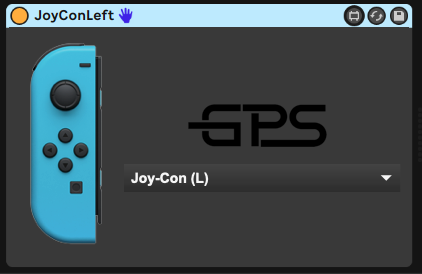
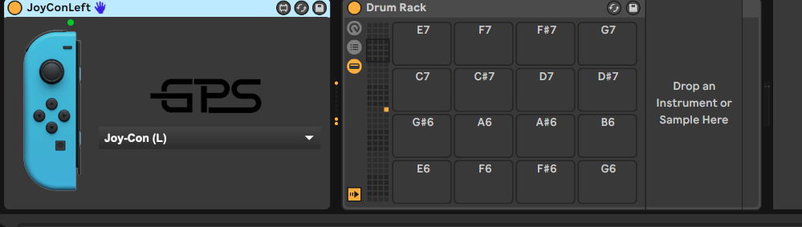
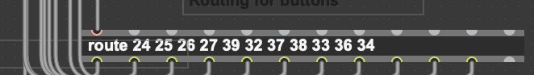
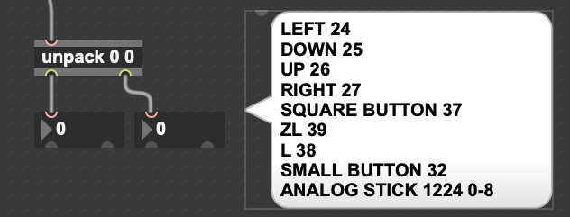

# Switch Midi M4L device

You will need [Max For Live](https://www.ableton.com/en/live/max-for-live/) for this to work.

This is the device you can download and drag into Ableton.

1. Pair you JoyCons first to your laptop/desktop bluetooth.

2. Then open Ableton and drag the .amxd into a midi track. 

3. Select JoyConL in the drop down of the M4L device, should look like this

4. Add a drum rack or any instrument that accepts midi to the right and when you hit a button on the switch it should trigger that note on the instrument

You can purchase the entire Ableton set I built [here](https://gum.co/SRoCs) in case you don't want to figure out how to get this running.

# If you have an older switch

It looks older switches have different configurations for button numbers, if that is your case. Then you will have to edit your routing object. 

I have provided the values here 

Hit each button and make note of the value that comes out from the left number box of the unpack 0 0 object and change that value in the route object.

Same for joy sticks, mine is 1224 and 0 - 8 depending on which direction I move it.

FFigure those out by looking at the unpack and change as needed.